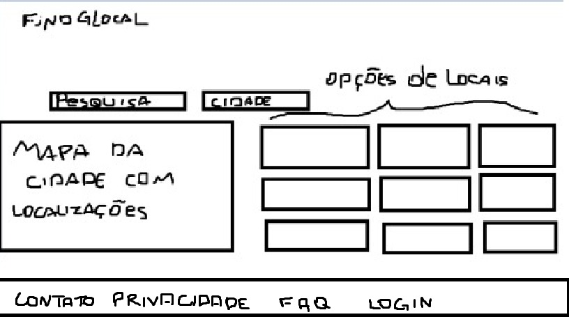
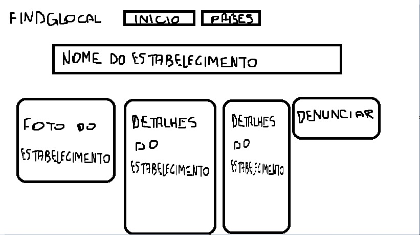
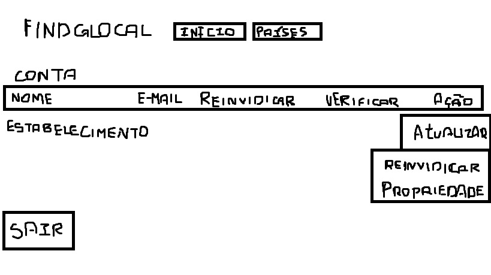
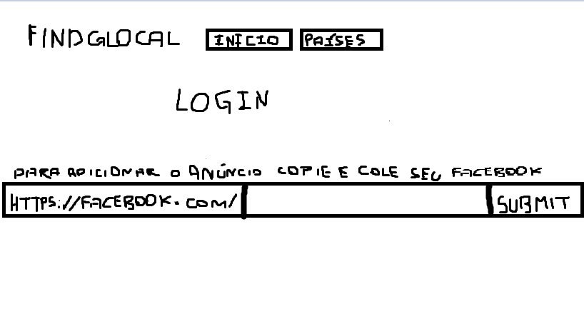

# Planejamento da Avaliação do Protótipo de Papel

## 1. Introdução

O protótipo de papel é um exemplo de protótipo de baixa finalidade que é muito usado por ser rápido de fazer e possuir baixo custo em sua produção, sendo que auxilia a encontrar erros relacionados a usabilidade.Além disso, é muito importante utilizar na atividade de design para correção de erros e para consolidação de ideias sobre o produto. 

Após a realização do protótipo em papel é importante que se realize uma avaliação para verificar se não existem problemas de usabilidade na interface. 

## 2. Objetivos

Desse modo, temos como objetivo guiar o avaliador em sua avaliação do protótipo de papel de forma mais detalhada possível.

## 3. Metodologia e Tarefas

O método para esta avaliação será o da investigação, sendo que deverão ter de 5 a 12 usuários para realizarem as tarefas propostas a seguir, assim como, seguir os passos de preparação, coleta de dados e interpretação, consolidação dos resultados e relato dos resultados.

### 3.1. Termo de consentimento

O modelo adotado do termo de consentimento segue abaixo:

Eu, ______________, declaro, por meio deste termo, que concordei em ser entrevistado(a) e/ou
participar na pesquisa de campo referente ao projeto 
intitulado de IHC - FGA - Grupo 8 desenvolvida(o) por Antonio Aldísio, Álvaro  Gouvea, Bianca Sofia  Oliveira, Guilherme  Souza e Vinicius Porto  . Fui
informado(a), ainda, de que a pesquisa é coordenada  por André Barros, a
quem poderei contatar / consultar a qualquer momento que julgar necessário através do
e-mail andrebdes@unb.br.
Afirmo que aceitei participar por minha própria vontade, sem receber qualquer
incentivo financeiro ou ter qualquer ônus e com a finalidade exclusiva de colaborar para
o sucesso da pesquisa. 

Vale informar que as informações obtidas por meio deste questionário serão tratadas conforme a Lei n.º 13.709/2018 (Lei Geral de Proteção de Dados - LGPD), de modo a  proteger os dados dos entrevistados, garantindo sua integridade, privacidade, segurança e transparência das informações coletados.

### 3.2. Preparação

Na preparação são definidas as tarefas que os participantes realizarão, o perfil dos participantes e a criação do protótipo, nesse contexto, serão seguidas pelos participantes as seguintes tarefas: Login/cadastro, buscar loja e denunciar anúncio. Além disso, O perfil dos entrevistados naturalmente devem possuir o mesmo <a href="/2021.1-FindGlocal/requisitos/perfil_do_usuário/" >perfil dos usuários do FindGlocal</a>, porque dessa forma a análise sairá mais assertiva. Logo, os perfis que correspondem são pessoas que moram na cidade e/ou trabalham no centro, pequenos empresários, pessoas de todas as faixas etárias. Sendo assim, deve-se procurar pessoas com esse perfil. 

<figcaption> Figura 01 - pesquisa e opção de login </figcaption>

<figcaption> Figura 02 - passo 1 para denunciar anúncio após localiza-lo </figcaption>

<figcaption> Figura 03 - passo 2 para denunciar anúncio após localizar-lo </figcaption>

<figcaption> Figura 04 - passo 1 para cadastro e login </figcaption>

<figcaption> Figura 05 - passo 2 para cadastro e login </figcaption>

### 3.2 Coleta e Interpretação dos dados

Cada usuário deve interagir com a interface realizando as tarefas citadas acima, sendo que o avaliador deve listar os problemas encontrados, assim como, arrumar protótipo em caso de problemas simples, sendo que deve ser realizada por dois avaliadores, um simulando o comportamento do sistema e o outro analisando a experiência de uso e no final anotar os problemas encontrados.

|ID|Perguntas |Opções | 
|:--:|:--:|:--:|
|01|O quanto você já usou o FindGlocal para achar estabelecimentos|0()  1-2()  3-10()   10+()|
|02|Agora avalie o grau de dificuldade para realizar as tarefas propostas|1-Muito complicado()  2-Difícil()  3-Normal()  4-Fácil()  5-Muito fácil|
|03|Algum erro foi cometido na realização das tarefas propostas? se sim, quais?|Pergunta aberta|
|04|Você conseguiu concluir todas as tarefas propostas| Sim ()   Não() |
|05|Posssui alguma sugestão de melhoria? se sim, quais?|Pergunta aberta|
<figcaption> Tabela 1 - Perguntas que devem ser feitas aos participantes</figcaption>

### 3.3 Consolidação dos Resultados

Após as etapas anteriores, os avaliadores devem analisar os erros que não foram possíveis se serem resolvidos no reprojeto quando acontecem problemas simples, sendo que a solução para esses erros tem a prioridade com base na relevância, logo os avaliadores devem levar isso em consideração e sugerir melhorias para que se chegue a uma melhor versão do protótipo.

### 3.4 Relato dos Resultados

No final as seguintes coisas devem ser relatadas:

* Os objetivos da avaliação;
* Uma descrição do método de prototipação em papel;
* A quantidade e o perfil de avaliadores e também dos participantes;
* As tarefas que foram realizadas pelos usuários;
* Uma lista de problemas de usabilidade corrigidos durante a de avaliação e reprojeto, descrevendo o local, fator prejudicado relacionado a usabilidade, descrição do problema, ajuste que foi feito no protótipo, indicar se o problema continuou;
* Listar os problemas que ainda não foram corrigidos, indicando novamente o local, fator prejudicado relacionado a usabilidade, descrição do problema, prioridade e sugestão de melhoria;
* Indicações de partes do sistema que podem ser mais bem elaboradas.

## 6. Conclusão

O documento visa facilitar o processo de avaliação do protótipo em papel, guiando de forma clara o avaliador para que não haja dúvidas durante o processo.

## Bibliografia

BARBOSA, S.D.J.; SILVA, B.S. Interação Humano--Computador.Editora Campus- ElsevierElsevier, 2010.

## Versionamento

| Versão | Data | Modificação | Autor |
|--|--|--|--|
| 1.0 |17/09/2021 | Criação do site/Adição de conteúdo | Bianca Sofia e Guilherme Brito |
|1.1|18/09/2021| Criação dos protótipos e adição na página| Guilherme Brito e Bianca Sofia|

