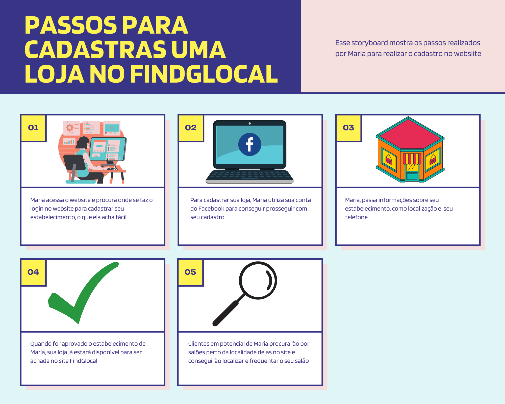
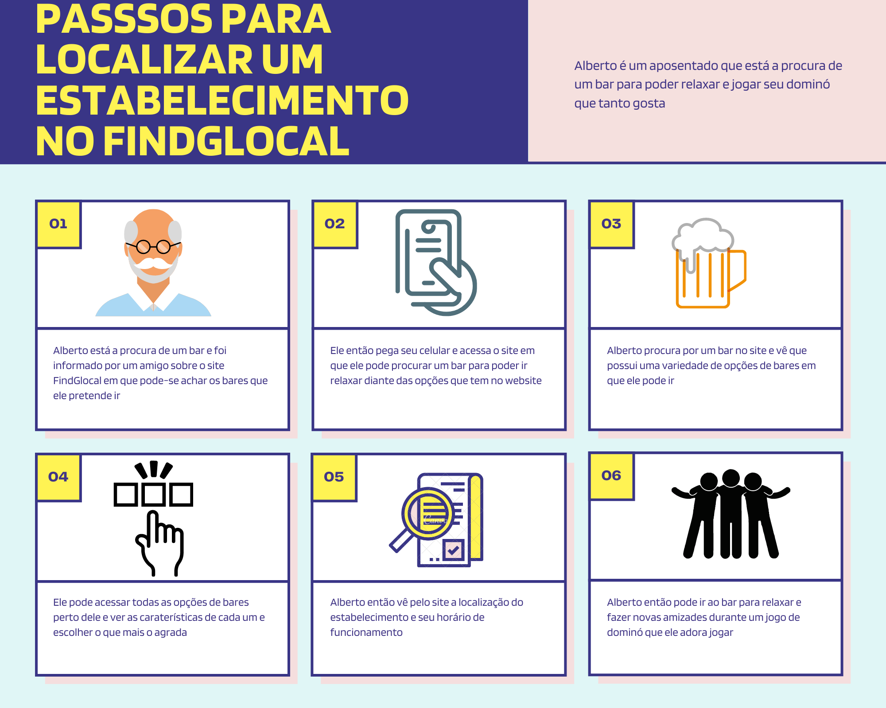
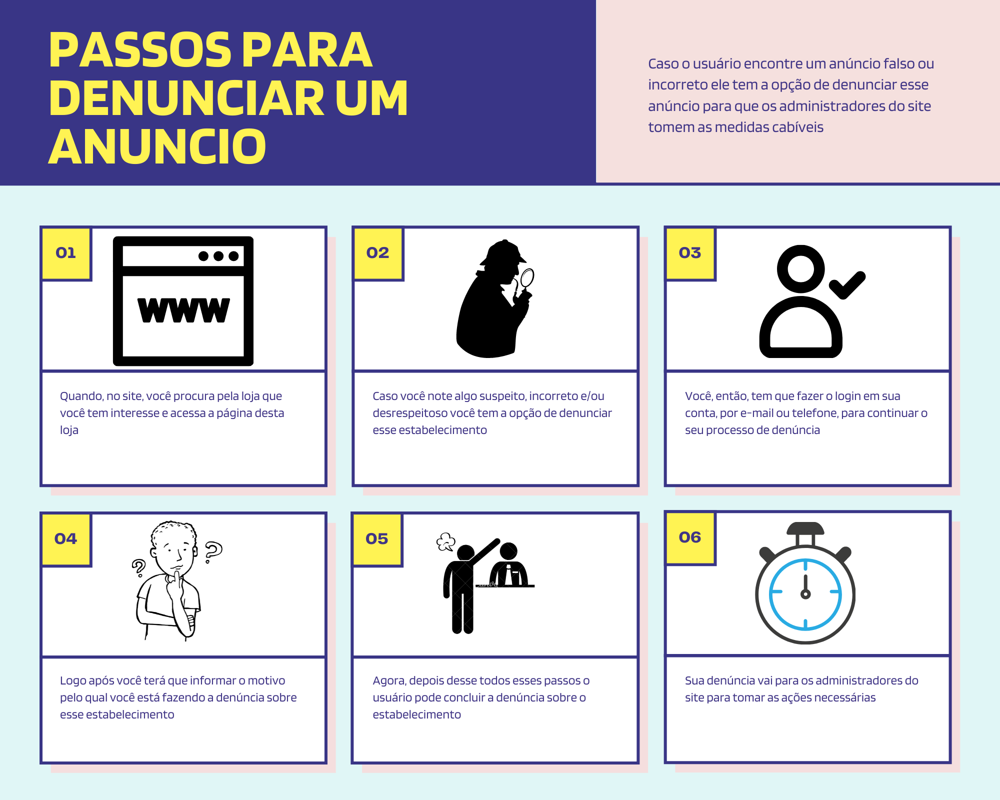

**# Storyboard ## Introdução** 

`    `Storyboards são desenhos que, em uma linha cronológica, contam uma história, roteiro, como se fosse uma história em quadrinhos. Esse storyboard será a respeito de um usuário que pretende acessar o website FindGlocal para realização de suas tarefas.

**## Storyboard**

`    `Nos storyboards a seguir eles contarão as histórias de 2 personas. A primeira persona é a Maria, que possui um salão de beleza e deseja o cadastrar no site FindGlocal. A segunda persona é Alberto, que é um ex policial que busca um bar para poder relaxar. Os storyboards serão como roteiros dessas duas personas para realizar suas tarefas.

**## \*Storyboard de cadastro\*** 

**## \*Storyboard de localização de estabelecimento\* **

**## \*Denunciar anúncio\*** 

