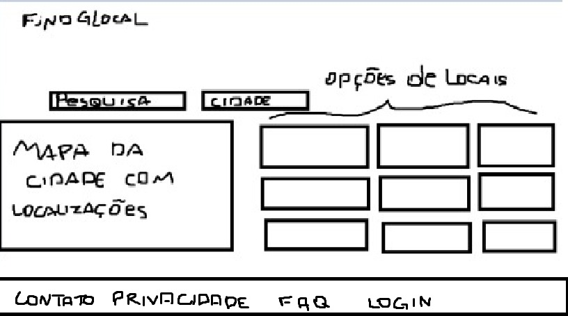
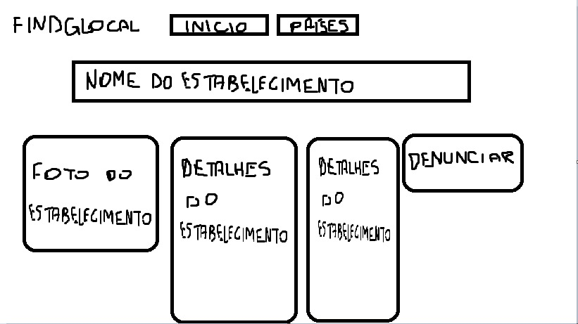
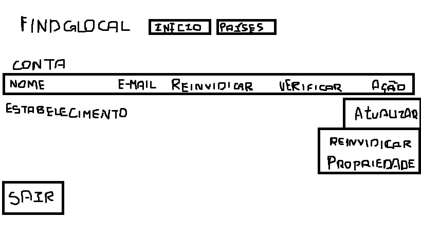
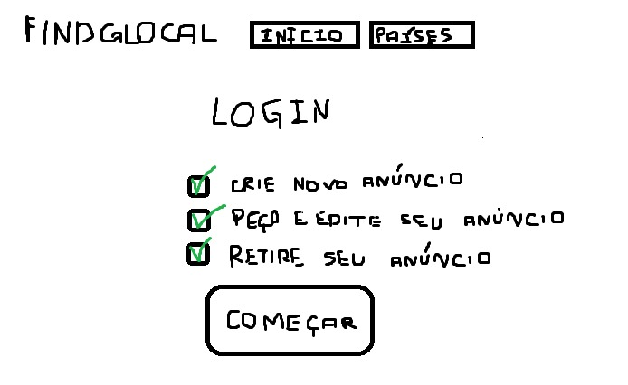
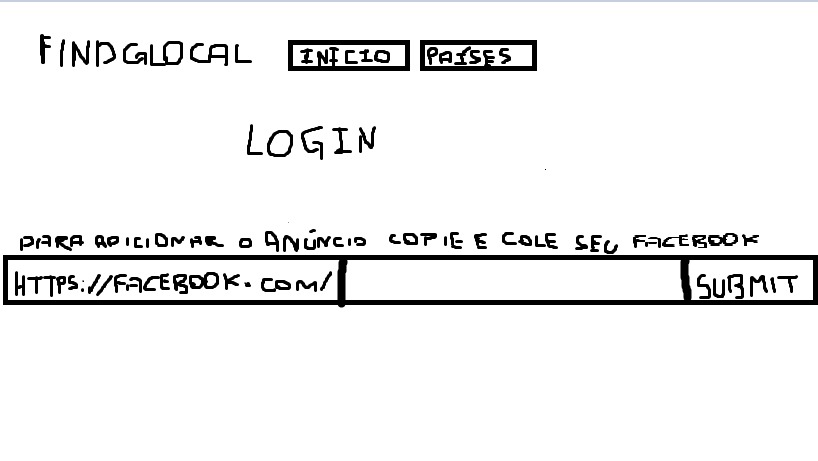

# Protótipo de baixa fidelidade

## 1. Introdução

O protótipo de papel é um exemplo de protótipo de baixa finalidade que é muito usado por ser rápido de fazer e possuir baixo custo em sua produção, sendo que auxilia a encontrar erros relacionados a usabilidade.Além disso, é muito importante utilizar na atividade de design para correção de erros e para consolidação de ideias sobre o produto. 

Após a realização do protótipo em papel é importante que se realize uma avaliação para verificar se não existem problemas de usabilidade na interface. 

 Nas figuras 01,02,03,04 e 05 podemos ver o desenolvimento do protoripo de baixa fidelidade.

<figcaption> Figura 01 - pesquisa e opção de login </figcaption>

<figcaption> Figura 02 - passo 1 para denunciar anúncio após localiza-lo </figcaption>

<figcaption> Figura 03 - passo 2 para denunciar anúncio após localizar-lo </figcaption>

<figcaption> Figura 04 - passo 1 para cadastro e login </figcaption>

<figcaption> Figura 05 - passo 2 para cadastro e login </figcaption>

| Versão | Data | Modificação | Autor |
|:--:|:--:|:--:|:--:|
| 1.0  | 15/08/2021 | refatorção de página | Antônio Aldísio |

