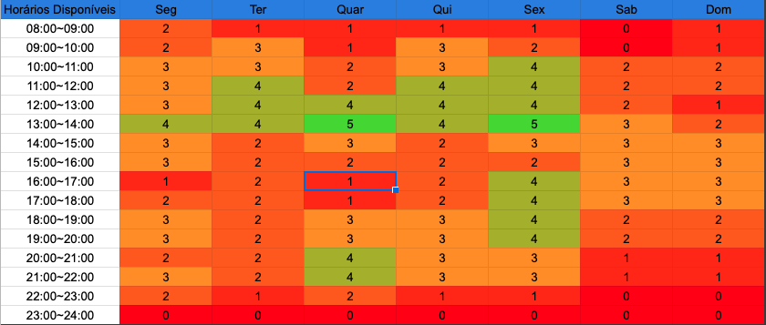
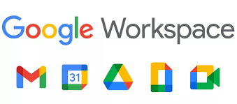

# Planejamento 
## 1. Sites avaliados individualmente

Os sites analiados pelo interantes já fazia parte de outros projetos com isso tivemos que procurar na internet outros sites. Foram os seguintes sites analisados em conjunto pela equipe:

- Findglocal;
- geipot.gov.br;
- mint.com;
- MPU;
- Detran DF;

Entre esses a equipe escolheu o <a href="https://www.findglocal.com/"><strong>Findglocal</strong></a>

## 2. Metodologia  

Todos os membros presentes na reunião queriam trabalhar com Scrum ou kanban. Foram levantados os pontos fortes de cada técnica do ponto de vista da equipe, como visto na tabela 01.

| Técnica | Vantagens | Desvantagens |
|--|--|--|
| Scrum | Contato diário com o projeto   Correção de erros mais rápido | Necessidade de reunião diária   Necssidade de daliy| 
| Kanban | Trasnparência entre a equipe   Controle sobre as atividades | Não teve apresetação de desvantagens |

<figcaption> 
Tabela 1 -Vantagens e desvantagens das tecnicas Scrum e Kanban</figcaption> 

Como o kanban não apresentou nenhuma desvantagem o grupo teve a preferência de sua escolha.

O método kanban é um sistema ágil e visual para gestão de tafefas. Ele é divido em 3 grupos: fazer,fazendo e feito [1].

O <a href="https://trello.com/invite/b/s12YKWmv/527876c609dd986d7c9343b09588115d/kanban-template">trello</a> será nossa ferramenta kanban.

### 2.1  Cronograma de atividades 

 Conforme as datas estipuladas pelo professor foi levantado um cronograma das atividades a serem realizadas. Vale salientar que as datas podem ser alteradas ao decorrer do tempo.

| Título|  Data de entrega |  Descrição|
|:------:|:-----------------------------:|:----------------------------------:|
|Etapa 1| 16/08| Planejamento do projeto e do Processo de Design|
|Etapa 2| 28/08| Perfil do usuário, Personas e Análise de tarefas|
|Etapa 3| 04/09| Princípios Gerais de Projeto, Metas de usabilidade, Guia de Estilo|
|Etapa 4| 08/09|  Planejamento da Avaliação e planejamento do relato dos resultados da avaliação do Storyboard e Análise de tarefas|
|Etapa 5| 20/09| Relato dos resultados do Story Board e da Análise de tarefas e o Planejamento da Avaliação e do relato dos resultados da avaliação do Protótipo de Papel|
|Etapa 6| 02/10|  Relato dos resultados do Protótipo de Papel e Planejamento da Avaliação e o relato dos resultados da avaliação do protótipo de alta fidelidade|
|Etapa 7| 04/10| Verificação dos artefatos|

<figcaption>
Tabela 2 - Cronograma de atividades</figcaption>

## 3  Disponibilidade dos integrantes

 A figura 01 apresenta o quadro de disponbilidade geral dos integrantes do grupo.

<figcaption>Figura 01 - Quadro de disponibilidade geral dos integrantes </figcaption>

<strong>Obs</strong>: pode sofrer alteração ao longo do semestre.

## 4. Processo de design

 O processo de design a ser seguido será o ciclo de vida de mayhew, que é um ciclo de vida relacionado a usabilidade, sendo que ele reúne e organiza diferentes atividades no campo da interação homem-computador para orientar o trabalho do designer para uma boa solução interativa. Esse ciclo de vida possui as seguintes fases: análise de requisitos, design/avaliação/desenvolvimento e instalação [3].

- 
 <strong> Análise de requisitos:</strong> Nessa fase as metas de usabilidade são identificadas tendo como base os perfis do usuário, análise de tarefas, possibilidades e limitações da plataforma na qual o sistema será executado e princípios gerais de design IHC [3]. 

- 
 <strong> Design, avaliação e desenvolvimento:</strong> Tem como objetivo chegar a uma solução de IHC que satisfaça às metas da fase de análise de requisitos [3].

- 
 <strong>Instalação: </strong> O design busca por opiniões dos usuários após algum tempo de uso do sistema [3].

<figcaption> 
Figura 01: Ciclo de Mayhew. Fonte: [2] </figcaption>

## 4. Ferramentas Utilizadas

| Ferramenta | Nome | Descrição |
|:--:|:--:|:--:|
||<a href="https://github.com/Requisitos-de-Software/2021.1-Caixa_Tem" target="_blank">Github| Ferramenta de controle de versão de arquivos e código |   
||<a href="https://google.com/" target="_blank">Google Workspace| Ferramenta de compatilhamento de arquivo |  
||<a href="https://google.com/" target="_blank"> Teams| Ferramenta  de reunião do grupo e gravação de apresentaçōes |  
||<a href="https://web.whatapp.com/" target="_blank"> Whatsapp| Mensageiro principal do grupo para diálogo  |  
||<a href="https://youtube.com/" target="_blank"> Youtube| Plataforma de upload e visualização das apresentaçōes |  
||<a href="https://youtube.com/" target="_blank"> Mkdocs| Ferramenta gerador de site estático minimalista|  

## Bibliografia 

 [1]  https://artia.com/kanban/

 [2]  BARBOSA, Simone et al. "Interação Humano-Computador". 2010. p. 110. 

 [3] Barbosa, S. D. J.; Silva, B. S. da; Silveira, M. S.; Gasparini, I.; Darin, T.; Barbosa, G. D. J. (2021) Interação Humano-Computador e Experiência do usuário. Autopublicação. 

## Versionamento

| Versão | Data | Modificação | Autor |
|--|--|--|--|
| 1.0 | 10/08/2021 | Criação do site | Antônio Aldísio |
| 1.1 | 12/08/2021 | Adição de conteúdo | Sofia  Oliveira e Antônio Aldísio |

