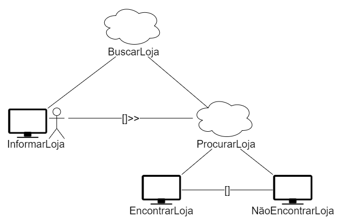
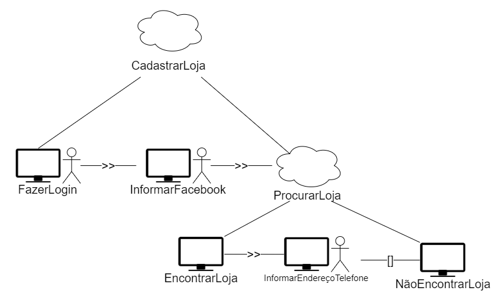

# Análise de tarefas

## 1.Introdução

A Análise de Tarefas é utilizada para se ter um entendimento sobre qual é o trabalho dos usuários, como eles o realizam e por quê. Nesse tipo de análise, o trabalho é definido em termos dos objetivos que os usuários querem ou precisam atingir.

## 2. Árvore de tarefas concorrentes (CTT - Concur Task Trees) 

Assim como o HTA o CTT também utiliza de uma estrutura hierárquica de tarefas 
para conseguir reproduzir o fluxo de funcionamento de um sistema, o que o torna
diferencial é a sua representação não estar limitada as tarefas diretamente
executadas pelo usuário ou pelo sistema, mas também se valer de abstração de
tarefas mais complexas para fragmentá-las e assim seguir o fluxo.

### 2.1 CTT 01 - Buscar Loja

<figcaption>Figura 03 - CTT 01 Buscar loja </figcaption>
  

### 2.2 CTT 02 - cadastrar Loja

<figcaption>Figura 04 - CTT 02 Buscar loja </figcaption>
  

## Bibliografia 

 [1] Barbosa, S. D. J.; Silva, B. S. da; Silveira, M. S.; Gasparini, I.; Darin, T.; Barbosa, G. D. J. (2021) Interação Humano-Computador e Experiência do usuário. Autopublicação. 

## Versionamento

| Versão | Data | Modificação | Autor |
|--|--|--|--|
| 1.0 | 19/08/2021 | Criação do site | Antônio Aldísio |
| 1.1 | 25/08/2021 | Acréscimo do conteúdo de HTA | Antônio Aldísio |
| 1.3 | 25/08/2021 | Acréscimo do conteúdo de CTT | Álvaro  Gouvea |
| 1.4 | 30/08/2021 | Revisado | Guilherme e Bianca Sofia |
| 1.5 | 02/08/2021 | Separação de página | Antônio Aldísio |

