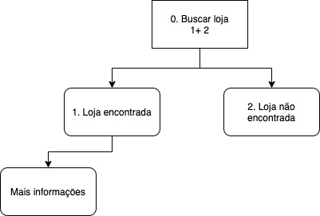
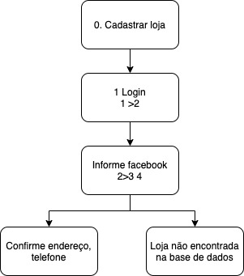

# Análise de tarefas

## 1.Introdução

A Análise de Tarefas é utilizada para se ter um entendimento sobre qual é o trabalho dos usuários, como eles o realizam e por quê. Nesse tipo de análise, o trabalho é definido em termos dos objetivos que os usuários querem ou precisam atingir.

## 2. Análise Hierárquica de Tarefas ( HTA – Hierarchical Task Analysis)

É um procedimento para aprender padrões usados nos fluxos de trabalho e
a ordem das interações com a interface (GUI). A análise considera as
maneiras pelas quais o usuário particiona as tarefas e as sequencia.
Procedimento de decomposição de tarefas em subtarefas que podem ser
analisadas usando a sequência lógica para execução.

"Uma hierarquia é uma organização de elementos que, de acordo com as
relações de pré-requisito, descreve o caminho das experiências que um
aprendiz deve seguir para alcançar qualquer comportamento único que
pareça mais alto na hierarquia. (Seels & Glasgow, 1990, p. 94)".

### 2.1 HTA 01 - Buscar Loja

<figcaption>Figura 01 - HTA 01 Buscar loja </figcaption>

### 2.2 HTA 02 - Cadastrar Loja

                                                                                                                                            

<figcaption>Figura 01 - HTA 02 Cadastrar loja </figcaption>
                                                                           

## Bibliografia 

 [1] Barbosa, S. D. J.; Silva, B. S. da; Silveira, M. S.; Gasparini, I.; Darin, T.; Barbosa, G. D. J. (2021) Interação Humano-Computador e Experiência do usuário. Autopublicação. 

## Versionamento

| Versão | Data | Modificação | Autor |
|--|--|--|--|
| 1.0 | 19/08/2021 | Criação do site | Antônio Aldísio |
| 1.1 | 25/08/2021 | Acréscimo do conteúdo de HTA | Antônio Aldísio |
| 1.3 | 25/08/2021 | Acréscimo do conteúdo de CTT | Álvaro  Gouvea |
| 1.4 | 30/08/2021 | Revisado | Guilherme e Bianca Sofia |
| 1.5 | 02/08/2021 | Separação de página | Antônio Aldísio |

