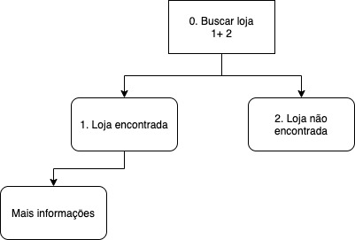
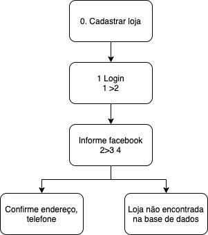
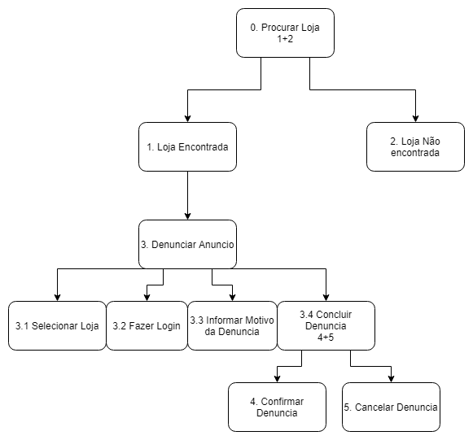

# Análise de tarefas

## 1.Introdução

A Análise de Tarefas é utilizada para se ter um entendimento sobre qual é o trabalho dos usuários, como eles o realizam e por quê. Nesse tipo de análise, o trabalho é definido em termos dos objetivos que os usuários querem ou precisam atingir.

## 2. Análise Hierárquica de Tarefas ( HTA – Hierarchical Task Analysis)

É um procedimento para aprender padrões usados nos fluxos de trabalho e
a ordem das interações com a interface (GUI). A análise considera as
maneiras pelas quais o usuário particiona as tarefas e as sequencia.
Procedimento de decomposição de tarefas em subtarefas que podem ser
analisadas usando a sequência lógica para execução.

"Uma hierarquia é uma organização de elementos que, de acordo com as
relações de pré-requisito, descreve o caminho das experiências que um
aprendiz deve seguir para alcançar qualquer comportamento único que
pareça mais alto na hierarquia. (Seels & Glasgow, 1990, p. 94)".

### 2.1 HTA 01 - Buscar Loja

<figcaption>Figura 01 - HTA 01 Buscar loja </figcaption>

|Objetivos\Operações| Recomendações|
|:--:| :--:|
|Buscar loja| Ação: procurar uma loja|
|Loja encontrada| Ação: Selecionar estabelecimento desejado|
|Mais informações| Ação: Coletar dados do estabelecimento|

<figcaption>Tabela 01 - HTA 01 Buscar loja </figcaption>

### 2.2 HTA 02 - Cadastrar Loja

                                                                                                                                            

<figcaption>Figura 02 - HTA 02 Cadastrar loja </figcaption>
                                           

|Objetivos\Operações| Recomendações|
|:--:| :--:|
|Cadastrar loja| Ação: Selecionar opção de cadastrar uma loja|
|Login| Ação: Realizar login |
|Informe facebook| Ação: Realizar login via url do facebook|
|Confirme endereço e telefone|Ação: Informar endereço e telefone para confirmar| 

<figcaption>Tabela 02 - HTA 02 Cadastrar loja </figcaption>

### 2.3 HTA 03 - Denúnciar Anúncio

                                                                                                                                            

<figcaption>Figura 03 - HTA 03 Denunciar Anuncio </figcaption>

                                           

|Objetivos\Operações| Recomendações|
|:--:| :--:|
|Procurar loja| Ação: Selecionar loja|
|Loja encontrada| Ação: Clicar em mais opções|
|Denunciar anúncio| Ação: Realizar operação de login|
|Informar motivo da denuncia|Ação: Realizar denúncia| 
|Concluir denúncia| Ação: Confirmar denúncia ou cancelar|

<figcaption>Tabela 03 - HTA 03 Denunciar Anuncio </figcaption>
                                                                           

## Bibliografia 

 [1] Barbosa, S. D. J.; Silva, B. S. da; Silveira, M. S.; Gasparini, I.; Darin, T.; Barbosa, G. D. J. (2021) Interação Humano-Computador e Experiência do usuário. Autopublicação. 

## Versionamento

| Versão | Data | Modificação | Autor |
|--|--|--|--|
| 1.0 | 18/10/2021 | Criação do site e criação de nova versão | Antônio Aldísio e Bianca Sofia|

