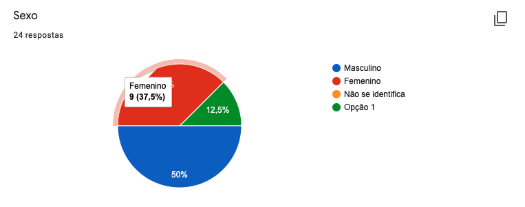
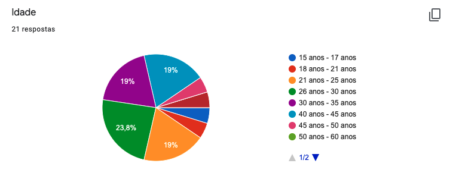
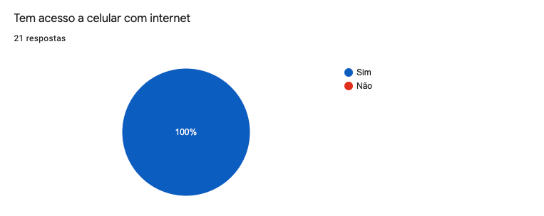
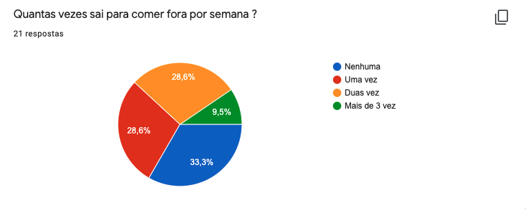
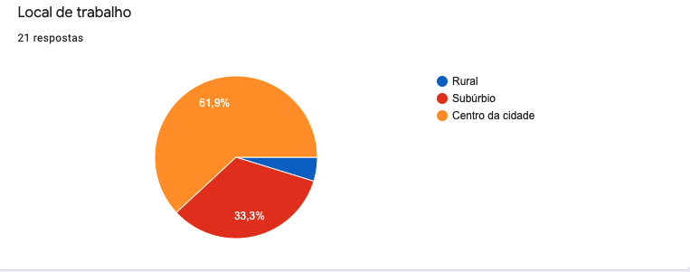
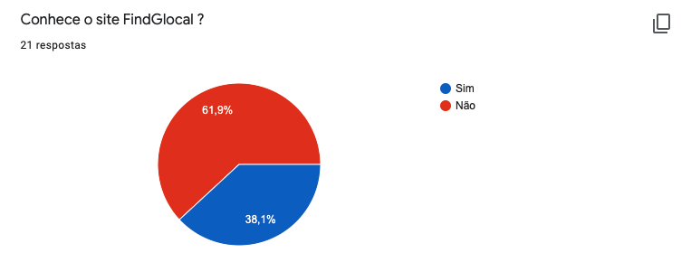
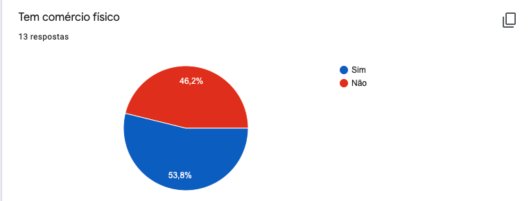

# Questionário
## 1. Introdução

 O questionário é uma técnica que permite a rápida obtenção de informações quantitativas e qualitativas de um público-alvo numeroso. Quando aplicada a uma amostra representativa do público, permite representar as opiniões de toda a população.

É uma técnica relativamente rápida e barata de ser aplicada e é muito útil quando a o público-alvo está disperso geograficamente.<a href="#Bibliografia">[1]</a> 

## 2. Metodologia

O questionário foi elaborado pelo membro  Guilherme e posteriormente revisado por Antônio Aldísio. O questionário possui perguntas relacionadas ao uso do aplicativo e perguntas genéricas com o intuito de descobrir o perfil dos usuários.

## 3. Resultado do Questionário

O questionário foi aplicado entre os dias 20/08/2021 e 28/08/2021 e obteve 24 respostas. Vale resalta que nem todos os participantes responderam todas as perguntas.e Os dados obtidos podem ser analisados a seguir:

### 3.1. Seção Inicial
#### Questão 1

<figcaption>Figura 01 - Questão sobre o gênero do entrevistado</figcaption>

#### Questão 2

<figcaption>Figura 02 - Questão sobre a idade do entrevistado</figcaption>

#### Questão 3

<figcaption>Figura 03 - Questão se tem internet no celular</figcaption>

#### Questão 4

<figcaption>Figura 04 - Questão de quantas vezes sai para comer</figcaption>

#### Questão 5

<figcaption>Figura 05 - Questão  onde trabalha</figcaption>

### 3.2. Seção 2 - Sobre o FindGlocal

#### Questão 6

<figcaption>Figura 06 - Questão se conhece o site</figcaption>

#### Questão 7

<figcaption>Figura 07 - Questão se tem comercio </figcaption>

## 6.Bibliografia 

 [1] VAZQUEZ, Carlos Eduardo; SIMÕES, Guilherme Siqueira. Engenharia de Requisitos: Software Orientado ao Negócio. Rio de janeiro: Brasport, 2016.

## Versionamento

| Versão | Data | Modificação | Autor |
|--|--|--|--|
| 1.1 | 25/08/2021 | Acréscimo do conteúdo | Guilherme |
| 1.2 | 25/08/2021 | Revisado | Antônio Aldísio |
| 1.3 | 30/08/2021 | Organização de página | Antônio Aldísio |

